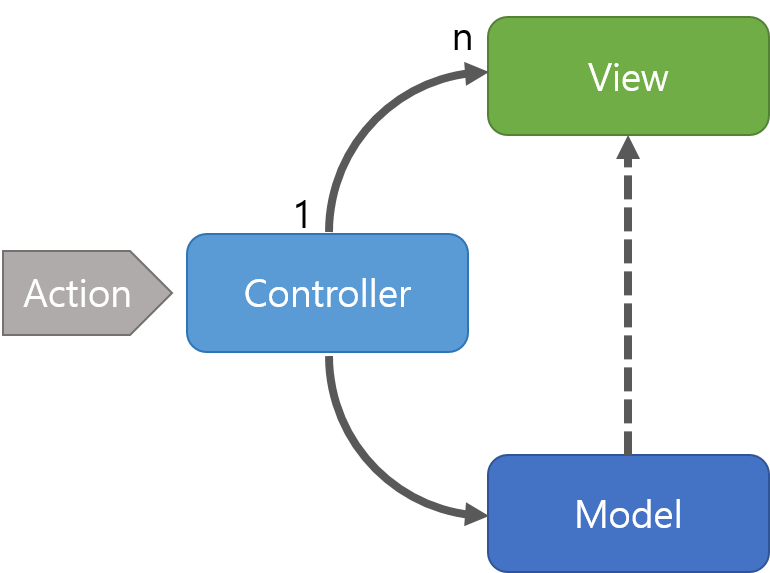
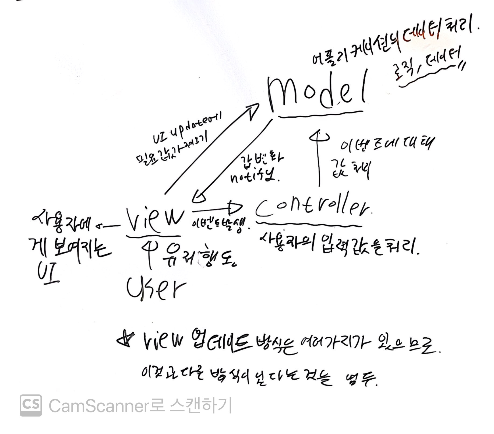
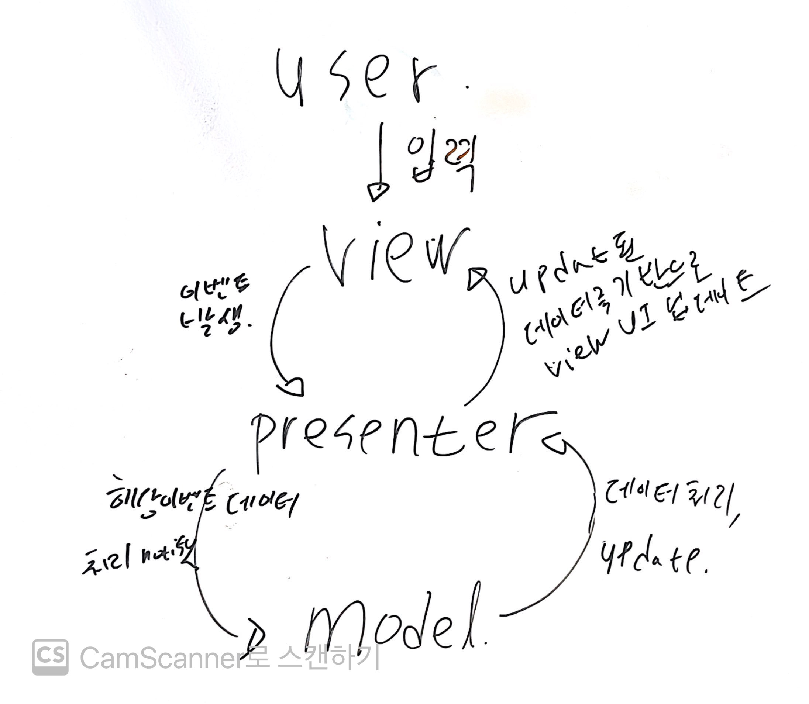

# MVC, MVP, MVVM 에 대해서 알아보자.

개발 공부를 하면서 위의 세가지 페턴을 많이 들어보았다.
응용 프로그램을 만들면서 가장 필요한것이 유지보수와 개발효율이다. 이를 효율적으로 하기위해 고안한 디자인 패턴이 위의 세가지 형태이다.

## MVC 모델

예시그림

공부한 토대로 작성한 그림

 - view : 사용자에게 보여지는 UI
 - controller : 사용자에게 입력을 받고 처리하는 역할
 - model : 어플리케이션에서 사용하는데이터, 데이터를 처리하는 부분(로직, 데이터)

위의 모델중에 가장 간단하고 구현하기 쉬운 모델.

ui에서 사용자들이 입력을 하여 이벤트를 발생시키면, 이에  controller가 이벤트를 확인하고 model에 이벤트에 관한 데이터를 처리하라 신호를 보낸다.
이에 model은 관련 이벤트에 대해 처리하고, 이를 view에게 값이 변경됬음을 알리는 신호를 보내고 view는 model에세 업테이트 관련값을 요청을 한다.

**Controller는 여러개의 View를 선택할 수 있는 1:n 구조이다.**
Controller는 View를 선택할 뿐 직접 업데이트 하지 않습니다.

### 장점
널리 사용되고있고 상대적으로 단순하여 만들기 간단하다.

### 단점
model 과 view의 의존성이 크다. 또한 1:n의 관계이고 각각의 view 에 관련하여 이벤트를 처리할려면 컨트롤러의 규모가 비대해지고 이에 유지보수 비용이 추가적으로 발생한다.

## MVP 모델

 - view : 사용자에게 보여지는 UI
 - presenter : 사용자에게 입력을 받고 처리하는 역할
 - model : 어플리케이션에서 사용하는데이터, 데이터를 처리하는 부분(로직, 데이터)

ui에서 사용자들이 입력을 하여 이벤트를 발생시키면, 이에  presenter가 이벤트를 확인하고 model에 이벤트에 관한 데이터를 처리하라 신호를 보낸다.
이에 model은 관련 이벤트에 대해 처리하고, 이를 presenter 에게 처리 신호를 보내고, presenter 는 업데이트된 view 를 업데이트를 한다.

### 장점
View와 Model의 의존성이 없다.

### 단점
대신, presenter와 model 사이의 의존도가 커진다. 앱이 복잡해지면 복잡할수록 그 의존도가 배가 된다.

## MVVM 모델

Model : 어플리케이션에서 사용하는데이터, 데이터를 처리하는 부분(로직, 데이터)
View : 사용자에서 보여지는 UI.
View Model : View를 표현하기 위해 만든 View를 위한 Model. 
View를 나타내 주기 위한 Model이자 View를 나타내기 위한 데이터 처리를 하는 부분
  

View를 통해 이벤트 발생 -> Command 패턴으로 View Model에 event 전달 -> View Model에서 Model으로 필요한 데이터 요청 -> Model은 View Model에게 필요한 데이터 전달 ->  View Model은 응답 받은 데이터를 가공 및 저장. -> View는 View Model과 Data Binding하여 화면을 나타냄.

### 특징  
MVVM 패턴은 Command 패턴과 Data Binding 두 가지 패턴을 사용하여 구현되어 View와 View Model 사이의 의존성을 없엠. 또한 view 와 model 사이의 의존석이 없어 각각 독립적인것이 특징이나, 그 구조 덕분에 설계하기 어려워 지는 단점이 있음.
  
View Model과 View는 1:n 관계

### [커멘드 패턴](https://ko.wikipedia.org/wiki/%EC%BB%A4%EB%A7%A8%EB%93%9C_%ED%8C%A8%ED%84%B4)

(이해를 돕기위한 자료)

invoker, command 와  
receiver, ConcreteCommand 로 구성되어있는 디자인패턴이다.  

이 패턴의 핵심은 **캡술화** 이다. 
실행되는 기능을 **캡슐화** 해줌으로서 여러 기능을 실행할 수 있는 재사용성이 높은 클래스를 설계하는 패턴이다.  
이 친구의 핵심은 의존성 제거에 있는데,  
바로 여러 실행을 요구하는 호출자(invoker)와 실제 실행을 구현하는 수신자(receiver)를 실행시킬 기술을 캡슐화 하여 구분해 줄 수 있다.

이 패턴은 command 인터페이스 활용해 주는것 인데,  
receiver는 실행해야하는 기능들은 command 인터페이스를 상속하여 execute()에 구현하여 캠슐화 시켜주고, 이를 invoker에서 캡슐화된 command 인터페이스의 execute() 를 호출하여 일괄적으로 실핼할 수 있게 만들어 준다.  
(추후 코드로 구현한 코드 붙여넣기.)

### [데이터 바인딩](https://ko.wikipedia.org/wiki/%EB%8D%B0%EC%9D%B4%ED%84%B0_%EB%B0%94%EC%9D%B8%EB%94%A9)

추후에 한번 정리할 필요가 있다.
아는 것중에, React 가 아마 이 데이터 바인딩을 잘 활용하지 않았을까 싶다.